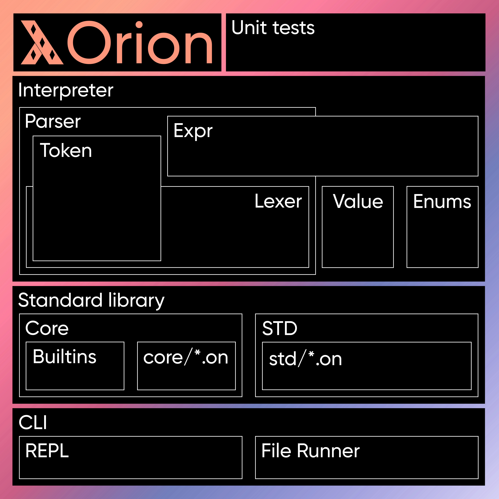

<div align="center">

Orion
=====

---

  

  Orion is a high level, purely functional programming language with a LISP based syntax.

  
  
  
  

</div>

---

Installation
------------

### MacOS, BSD and GNU/Linux

You will need: the Rust toolchain (1.50+), a "make" program, a POSIX shell (installed in `/bin/sh`) and Git.

```bash
$ git clone https://github.com/wafelack/orion.git
$ cd orion/
$ chmod +x configure
$ ./configure
$ make
$ make install PREFIX==/wherever/you/want/
```

### Windows

* Clone the project.
* Build with cargo.
* Copy `target/release/orion` to `C:/Program Files/Orion`.
* Copy `lib/` to `C:/Program Files/Orion/`.
* Add `C:/Program Files/Orion` to your `PATH`.

Documentation
-------------

You can find a small tutorial to get started with Orion [here](docs/tutorial.md).

You can find the standard library, the core and the builtins documentation [here](docs/).

Roadmap
-------

- [x] Lexing
- [x] Parsing
- [x] Evaluation
- [x] Core functionnality
- [x] Documentation
- [ ] Standard library.

Quick Example
-------------

Fibonnaci suite:
```clojure
(load "core/math.orn")
(def fibo (λ (n) 
	(match (< n 2) 
		(True n) 
		(_ (+ (fibo (- n 1)) (fibo (- n 2)))))))
```

Differences Between Older Orion and Newer Orion
-------------------------------------

The current Orion is purely functional, has enums, tuples, pattern matching, and a tiny builtin part.

The older Orion was functional and imperative, had mutation, and an enormous builtin part.

Code Structure
--------------



Performances
------------

Speed is not Orion's main goal, but here are some benchmarks.

### Ackermann péter function - m := 3 ; n := 3 - 500 runs

| Language |  Total  | Average | Median | Amplitude |
|----------|---------|---------|--------|-----------|
|   **Nixt**   | 63145ms |  **126ms**  |  121ms |   134ms   |
|**Older Orion** |  4398ms |   **8ms**   |   8ms  |  13ms         |
|__**Newer Orion**__ | 38053ms |   **76.106ms**  | 75ms | 21ms  |   
|**Python**| 258.46ms | **0.516ms** | 0.482ms | 0.541ms   |


Acknowledgments
---------------

* Lexer, parser, interpreter and documentation: Wafelack \<wafelack@protonmail.com>
* CI: Kreyren \<kreyren@fsfe.org>

Special thanks to [@Mesabloo](https://github.com/mesabloo) and [@felko](https://github.com/felko) for support and help about implementation details.

License
-------

This software and all associated items (assets, documentation, etc) are licensed under the GNU General Public License version 3.0 and higher.
